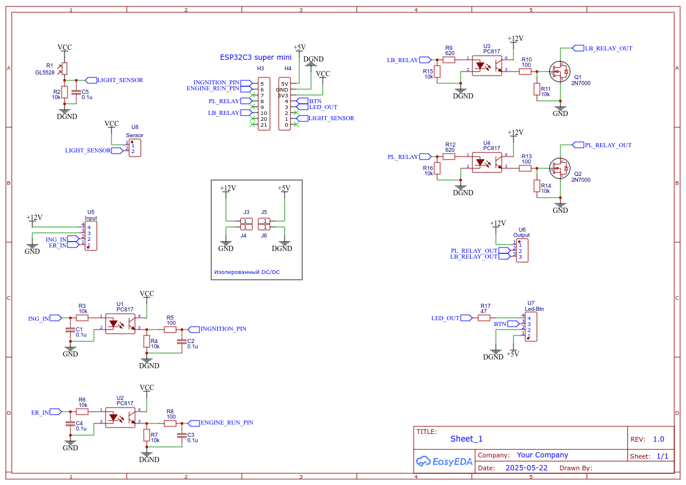

# SmartLightSensor v 1.1

Модуль для автоматического управления головным светом автомобиля. Построен на базе модуля **esp32c3 super mini**. Может управлять как габаритными огнями и ближним светом фар, так и дневными ходовыми огнями. В отличие от [autoLightManager](https://github.com/VAleSh-Soft/autoLightManager) не имеет часов, имеет только один светодиодный индикатор и управляется одной кнопкой. Настройка модуля осуществляется с помощью Web-интерфейса.

При запуске двигателя модуль включает головной свет или ДХО (если задано) (в зависимости от времени суток), а при выключении зажигания – отключает его. Включение и выключение может выполняться с настраиваемой задержкой.

Модуль отслеживает только момент запуска двигателя. По какой либо причине заглохший двигатель к отключению света не приведет.

Модуль позволяет отключить автоматический режим для управления головным светом в ручном режиме штатными переключателями.

- [Управление](#управление)
- [Индикация](#индикация)
- [Дневные ходовые огни](#дневные-ходовые-огни)
- [Принципиальная схема модуля](#принципиальная-схема-модуля)
- [Релейный модуль](#релейный-модуль)
- [Настройки скетча](#настройки-скетча)
- [Web-интерфейс](#web-интерфейс)
- [Обновление прошивки](#обновление-прошивки)
- [Использованные сторонние библиотеки](#использованные-сторонние-библиотеки)

### Управление

Модуль имеет одну кнопку, которая позволяет включать/выключать автоматический режим работы и включать/выключать **WiFi** для получения доступа к Web-интерфейсу с настройками.
- одиночный клик кнопкой включает автоматический режим работы;
- удержание кнопки нажатой в течение не менее одной секунды отключает автоматический режим работы;
- двойной клик кнопкой в любой момент включает и выключает WiFi;

Зажатая при включении или выходе из глубокого сна кнопка сбрасывает абсолютно все настройки модуля (в том числе настройки **WiFi**) к настройкам по умолчанию, заданным в файле **header_file.h**.

*Зажатую кнопку можно отпускать, как только светодиод загорится белым цветом - значит настройки уже сброшены, устройство готово к старту.*

### Индикация

Модуль имеет светодиодный индикатор для отображения текущего режима работы и состояния головного света автомобиля. Для индикации используется адресный светодиод **WS2811**.

Цвета индикатора имеют следующие значения:
- Автоматический режим выключен:
  - Красный – управление головным светом выполняется вручную штатными переключателями;
- Автоматический режим включен
  - Двигатель не заведен
    -	Зеленый – головной свет не включен;
  - Двигатель заведен
    - Желтый (оранжевый) – ближний свет фар не включен; работает ДХО (если задано);
    - Голубой – включен ближний свет фар;

При включенном **WiFi** индикатор мигает с частотой 1 Гц, цвет индикатора при этом соответствует текущему режиму работы и состоянию головного света.

### Дневные ходовые огни

Модуль позволяет управлять дневными ходовыми огнями (ДХО). Для включения этой возможности нужно задать макрос `#define USE_RELAY_FOR_DRL 1` и пин выхода реле в файле **header_file.h**.

В принципе правильно установленные и подключенные ДХО в управлении не нуждаются - они автоматически включаются при запуске двигателя и выключаются при включении ближнего света (габаритных огней). Однако, если Вы хотите, чтобы ДХО включались не в момент запуска двигателя, а с заданной задержкой, можно поручить их включение модулю. В этом случае ДХО будут включаться модулем, а их отключение при включении ближнего света (габаритных огней) будет лежать на совести самих ДХО :)

Если же ДХО на Вашем автомобиле не имеют опции автоотключения при включении ближнего света фар, или же вместо ДХО используются, например, противотуманные фары, модуль может взять на себя полное управление ими. Для этого нужно задать макрос `#define USE_DRL_MANAGEMENT 1` в файле **header_file.h**. В этом случае состояние выхода реле ДХО будет зависеть от состояния выхода реле габаритных огней (габаритные огни включены - ДХО выключены и наоборот).

### Принципиальная схема модуля

В схеме реализовано изолированное питание модуля. Для этого используется изолированный **DC/DC** преобразователь, например, такой:

который обеспечивает гальваническую развязку цепей питания от бортовой сети автомобиля.

### Релейный модуль

Для управления светом в дополнение к модулю используется релейный модуль, расположенный непосредственно возле штатных органов управления головного света и замыкающий своими контактами контакты штатных переключателей. Примерная схема релейного модуля:

Клеммы **P1** подключаются параллельно контактам, включающим ближний свет, клеммы **P2** - параллельно контактам, влючающим габаритные огни.

*ВАЖНО!!! - реле следует выбирать из расчета тока, потребляемого управляемой цепью. Для габаритных огней будет достаточно реле с максимальным током контактов 10А, для ближнего света лучше использовать стандартные автомобильные реле на 30А (в этом случае, возможно, придется заменить транзистор Q1 в схеме основного модуля более мощным)*

### Настройки скетча

Все настройки собраны в файле  **header_file.h**.

- `#define LOG_ON 1` - использовать или нет вывод отладочной информации в Serial
- `#define USE_RELAY_FOR_DRL 0`  - использовать или нет реле для ходовых огней; 
  - 0 - не использовать, 1 - использовать реле (ДХО будут включаться при старте двигателя по истечении заданного интервала задержки);
- `#define USE_DRL_MANAGEMENT 0` - управлять или нет ходовыми огнями; это может быть полезно, если ходовые огни не отключаются автоматически при включении ближнего света; 
  - 0 - не управлять, 
  - 1 - управлять (ДХО будут включаться и выключаться в зависимости от состояния реле габаритных огней)

Далее описаны пины для подключения датчика освещенности, кнопки, светодиодов, входных сигналов и выходов для управления реле. Описываются управляющие уровни реле, значения параметров по умолчанию, которые будут использоваться при первом запуске или сбросе настроек модуля, и индексы для сохранения параметров в **EEPROM**. См. комментарии к каждой строке.

*ВАЖНО!!! - параметр `constexpr uint8_t IGNITION_PIN` определяет пин, на который будет приходить сигнал при включении зажигания. Т.к. этот сигнал используется для пробуждения МК из глубокого сна, то выбирать его нужно из числа **GPIO** **VDD3P3_RTC**. Для **esp32c3** это **GPIO0..GPIO5**. Для других модификаций **esp32** смотрите их даташиты.*

Модуль не использует файловую систему **esp32c3**, поэтому можно выбрать **Partition Cheme**: **No FS 4MB (2MB APP x2)** или любую подобную.

### Web-интерфейс

Двойной клик кнопкой включает точку доступа модуля. Светодиод при этом начинает моргать с частотой 1 Гц. По умолчанию создается точка доступа `shSmartLight` с паролем `12345678`. Web-интерфейс при этом доступен по адресу `192.168.4.1`

Web-интерфейс имеет две вкладки - настройки модуля и настройки WiFI.

На первой вкладке можно настроить порог срабатывания датчика освещенности (**10%..100%**) и задержку отключения ближнего света фар при превышении данных датчика выше порога (**5..60** секунд). Задержка нужна для исключения множественного переключения при околопороговых показаниях датчика.

Так же здесь можно настроить задержку включения света при запуске двигателя (**0..10** секунд) и задержку ухода модуля в спящий режим после отключения зажигания (**0..60** секунд). Первая задержка позволяет снизить нагрузку на генератор автомобиля в момент старта двигателя, а вторая позволяет, кроме всего прочего, перезапустить двигатель без отключения света фар.

На второй вкладке можно изменить **SSID** и пароль точки доступа, а так же ее **IP**.

### Обновление прошивки

Модуль имеет возможность обновления прошивки "по воздуху" через Web-интерфейс. Для этого в адресной строке браузера нужно ввести адрес **http://192.168.4.1/firmware**, выбрать файл прошивки, нажать на кнопку **Обновить** и дождаться результата. 

### Использованные сторонние библиотеки

[FastLED.h](https://github.com/FastLED/FastLED) - рекомендую использовать версию **FastLed** не ниже **3.9.1** во избежание конфликтов с другими использованными библиотеками 
[shButton.h](https://github.com/VAleSh-Soft/shButton) -  
[ArduinoJson.h](https://github.com/bblanchon/ArduinoJson) -  работа с данными в формате JSON (код писался с использованием версии **6.21.5**, ниже версии 6.0 код скорее всего не будет компилироваться, с версиями 7.0 и выше работа не тестировалась); 

***

Если возникнут вопросы, пишите на valesh-soft@yandex.ru 